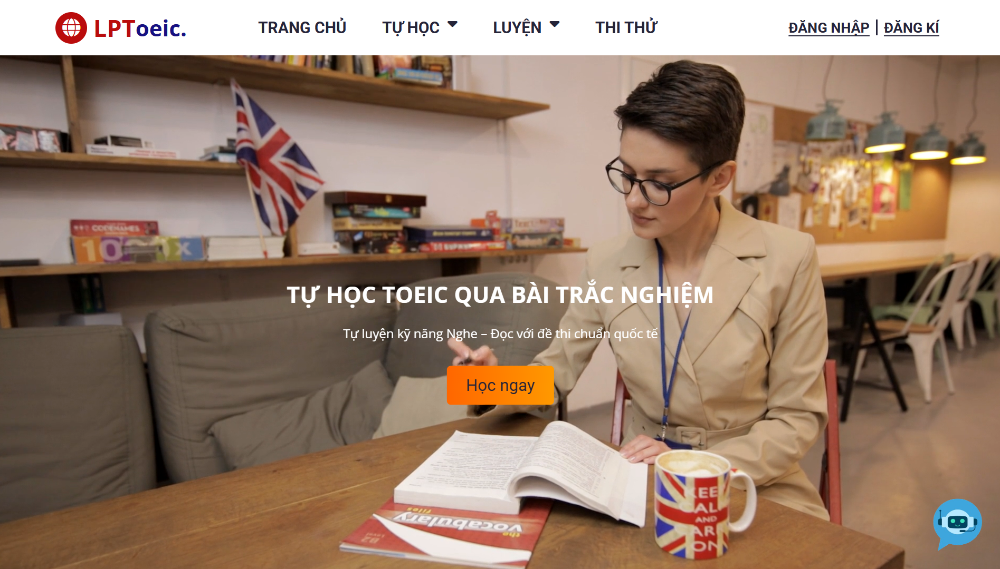
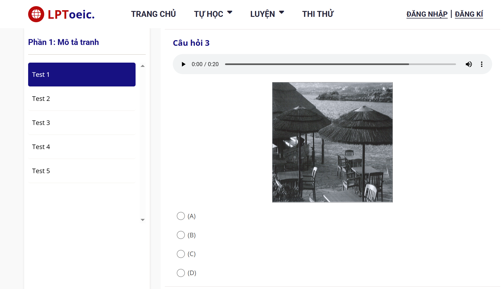
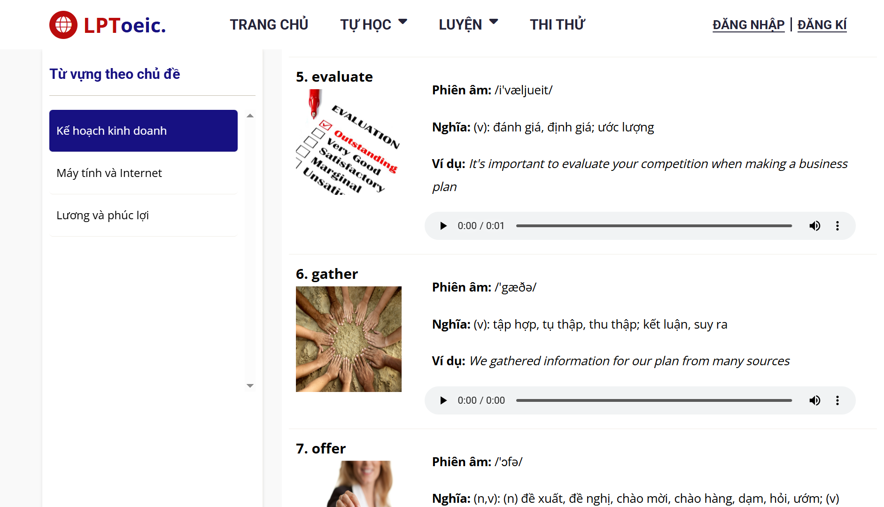
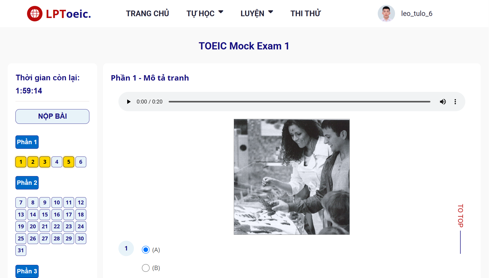
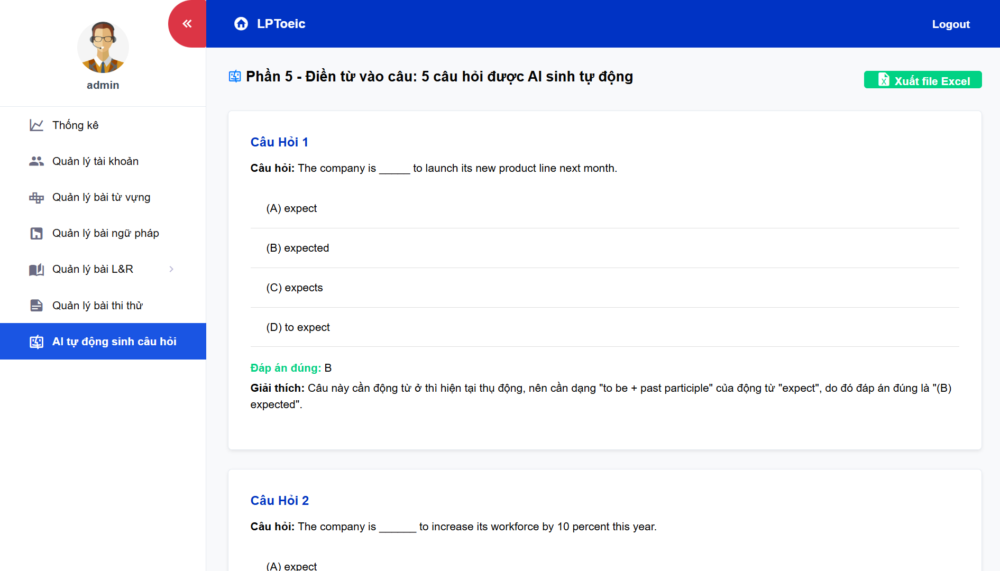
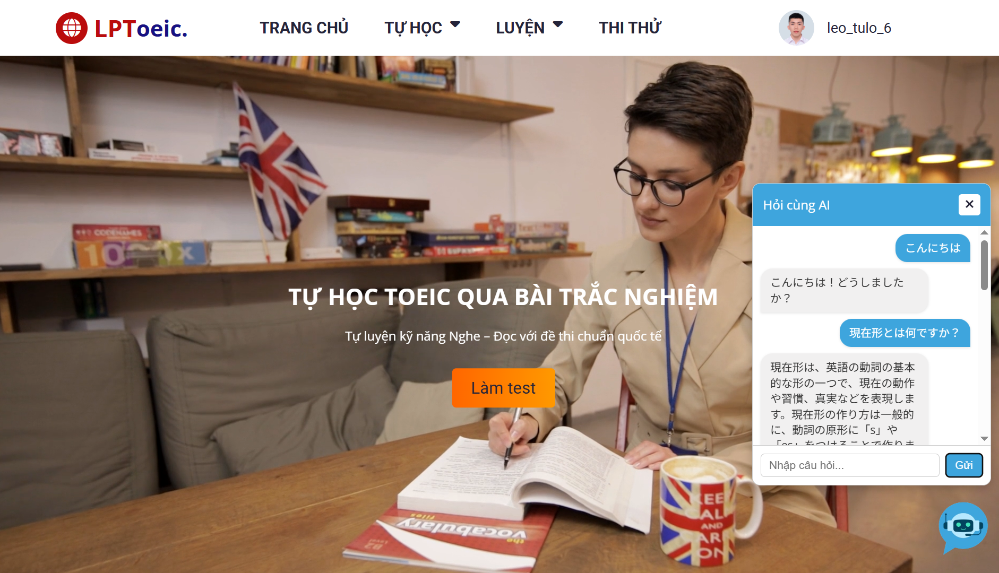
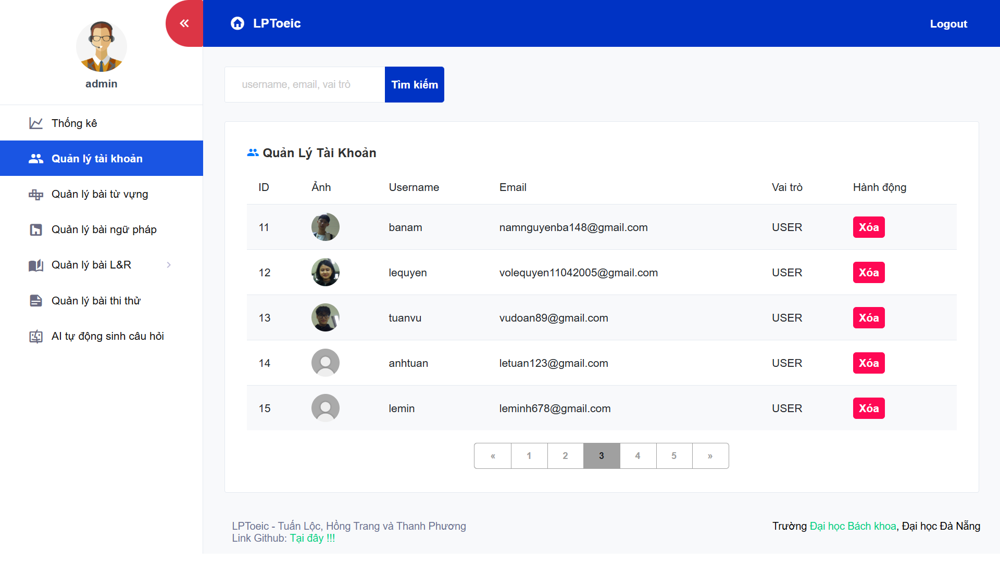

# 📚 PBL5-LPToeic – TOEIC Learning and Mock Test Web Application

---

### 🔍 Introduction

**PBL5-LPToeic** is a web application designed to support learners in practicing and taking mock TOEIC tests, covering all essential skills: Listening, Reading, and Grammar. The application features a user-friendly and intuitive interface, helping users practice effectively.

---

### 🚀 Key Features

- 📝 **Practice by TOEIC parts:**
  - 🖼️ Part 1: Photographs
  - ❓ Part 2: Question-Response
  - 🗣️ Part 3: Conversations
  - 📢 Part 4: Talks
  - ✍️ Part 5: Incomplete sentences
  - 📄 Part 6: Text completion
  - 📚 Part 7: Reading comprehension
- 📖 **Grammar lessons:** Detailed lectures with illustrative exercises.
- ⏱️ **Mock tests:** Simulate real TOEIC exams with strict time limits.
- ✅ **Automatic scoring:** Results and explanations displayed immediately after tests.
- 📊 **Performance statistics:** Track learning progress and improvement over time.
- 🗂️ **Vocabulary list:** Help learners expand vocabulary and improve test skills.

---

### 🖼️ UI/UX Screenshots & Descriptions

Below are some key interface screenshots demonstrating major features of the project. You can find the images in the `screenshots` folder of the repository.

| Screenshot                | Description                                              |
|---------------------------|----------------------------------------------------------|
|                                     | Homepage interface.                                       |
|                  | Listening practice interface (representing all 7 parts of Listening & Reading). |
|                         | Vocabulary learning interface (also represents grammar lessons). |
|                           | Mock test interface simulating real exam conditions.      |
|                     | Automatic question generation using AI.                   |
|                               | Chatbot interaction with users for learning support.     |
|       | Manage lessons: vocabulary, grammar, listening & reading exercises, and mock tests. |
|          | Manage user accounts (admin feature).                    |
|                           | Admin dashboard with data statistics and charts.          |

---

### 💻 Technology Stack

- ☕ **Backend:** Java (Spring Boot)  
- 🌐 **Frontend:** HTML, CSS, JavaScript, SCSS  
- 🛢️ **Database:** MySQL  

---

### 📂 Project Structure

```
PBL5-LPToeic/
├── .metadata/             # Project configurations
├── pbl5/                  # Backend source code
├── Upload Data/           # Uploaded data files
├── screenshots/           # UI/UX screenshots
├── Dump.sql               # Database backup file
└── README.md              # This README file
```

---

### ⚙️ How to Run

1. Clone the repository:
   ```bash
   git clone https://github.com/tuanloc782004/PBL5-LPToeic.git
   cd PBL5-LPToeic
   ```

2. Configure and run backend:
   - Open the `pbl5` folder in your Java IDE (IntelliJ, Eclipse, etc.).
   - Set up your database connection in `application.properties`.
   - Run the Spring Boot application.

3. Frontend:
   - Open the frontend interface in your web browser.

4. Database:
   - Import `Dump.sql` into your MySQL database.

---

### 📝 License

This project is licensed under the **MIT License**. Please see the `LICENSE` file for details.

---

### 🔗 Repository Link

[https://github.com/tuanloc782004/PBL5-LPToeic](https://github.com/tuanloc782004/PBL5-LPToeic)

---

Thank you for checking out the project! Feel free to contribute, report issues, or contact me for further collaboration.
