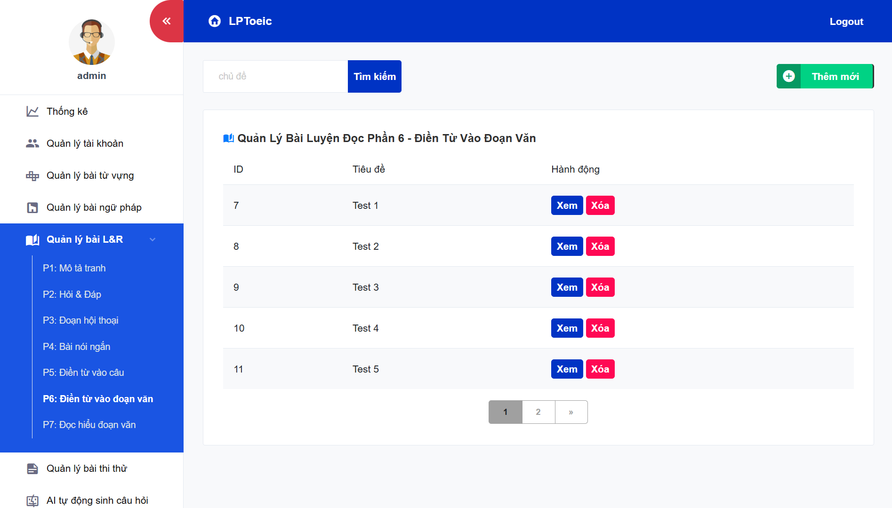
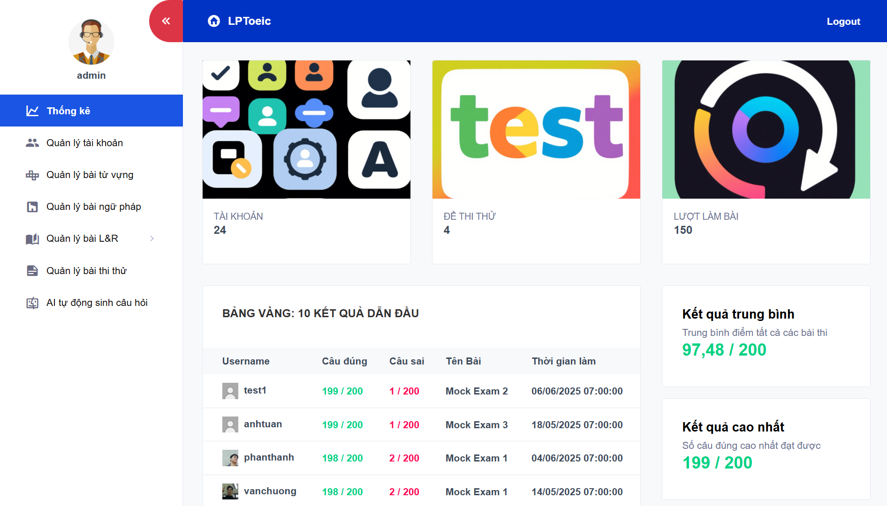

# 📚 PBL5-LPToeic – TOEIC Learning and Mock Test Web Application

---

### 🔍 Introduction

**PBL5-LPToeic** is a web application designed to support learners in practicing and taking mock TOEIC tests, covering all essential skills: Listening, Reading, and Grammar. The application features a user-friendly and intuitive interface, helping users practice effectively.

---

## 📑 Table of Contents

- [Introduction](#-introduction)
- [Key Features](#-key-features)
- [UI/UX Screenshots & Descriptions](#-uiux-screenshots--descriptions)
- [Technology Stack](#-technology-stack)
- [Project Structure](#-project-structure)
- [How to Run](#-how-to-run)
- [Deployment Overview](#-deployment-overview)
- [License](#-license)
- [Repository Link](#-repository-link)

---

## 🚀 Key Features

- 📝 **Practice by TOEIC parts:**
  - 🖼️ Part 1: Photographs
  - ❓ Part 2: Question-Response
  - 🗣️ Part 3: Conversations
  - 📢 Part 4: Talks
  - ✍️ Part 5: Incomplete sentences
  - 📄 Part 6: Text completion
  - 📚 Part 7: Reading comprehension
- 📖 **Grammar lessons:** Detailed lectures with illustrative exercises.
- ⏱️ **Mock tests:** Simulate real TOEIC exams with strict time limits.
- ✅ **Automatic scoring:** Results and explanations displayed immediately after tests.
- 📊 **Performance statistics:** Track learning progress and improvement over time.
- 🗂️ **Vocabulary list:** Help learners expand vocabulary and improve test skills.
- 🤖 **Learning Chatbot**: Helps learners practice English communication through natural conversation, interacting as if talking to a real person.
- ❓ **Automatic Question Generation**: Automatically creates new question sources, supporting administrators in quickly building a rich and diverse question bank.

---

## 🖼️ UI/UX Screenshots & Descriptions

Below are some key interface screenshots demonstrating major features of the project. You can find the images in the `screenshots` folder of the repository.

| Screenshot                | Description                                              |
|--------------------------|----------------------------------------------------------|
|                                     | Homepage interface.                                       |
|                  | Listening practice interface (representing all 7 parts of Listening & Reading). |
|                         | Vocabulary learning interface (also represents grammar lessons). |
|                           | Mock test interface simulating real exam conditions.      |
|                     | Automatic question generation using AI.                   |
|                               | Chatbot interaction with users for learning support.     |
|       | Manage lessons: vocabulary, grammar, listening & reading exercises, and mock tests. |
|          | Manage user accounts (admin feature).                    |
|                           | Admin dashboard with data statistics and charts.          |

---

## 💻 Technology Stack

- ☕ **Backend:** Java (Spring Boot)  
- 🌐 **Frontend:** HTML, CSS, JavaScript, SCSS  
- 🛢️ **Database:** MySQL  

---

## 📂 Project Structure

```
PBL5-LPToeic/
├── .metadata/             # Project configurations
├── pbl5/                  # Backend source code
├── Upload Data/           # Uploaded data files
├── screenshots/           # UI/UX screenshots
├── Dump.sql               # Database backup file
└── README.md              # This README file
```

---

## ⚙️ How to Run

1. Clone the repository:
   ```bash
   git clone https://github.com/tuanloc782004/PBL5-LPToeic.git
   cd PBL5-LPToeic
   ```

2. Configure and run backend:
   - Open the `pbl5` folder in your Java IDE (IntelliJ, Eclipse, etc.).
   - Set up your database connection in `application.properties`.
   - Run the Spring Boot application.

3. Frontend:
   - Open the frontend interface in your web browser.

4. Database:
   - Import `Dump.sql` into your MySQL database.

---

## 🚀 Deployment Overview

```bash
# 1. Prepare EC2 instance
- Launch an EC2 instance (e.g., t2.micro).
- Open ports: 22 (SSH), 80 (HTTP), 443 (HTTPS), 8080 (Spring Boot).
- SSH into the EC2 using your `.pem` key file.

# 2. Create Swap (if RAM is low)
sudo fallocate -l 2G /swapfile
sudo chmod 600 /swapfile
sudo mkswap /swapfile
sudo swapon /swapfile
echo '/swapfile none swap sw 0 0' | sudo tee -a /etc/fstab

# 3. Install MySQL and import database
sudo apt update && sudo apt install mysql-server -y
sudo mysql_secure_installation

# Create database
CREATE DATABASE pbl5 CHARACTER SET utf8mb4 COLLATE utf8mb4_unicode_ci;

# Upload dump file to EC2 and import
scp -i key.pem Dump.sql ubuntu@<EC2_IP>:~/
mysql -u root -p pbl5 < Dump.sql

# 4. Build and run Spring Boot with Docker
# Dockerfile
FROM openjdk:17-jdk-slim
ARG JAR_FILE=target/*.jar
COPY ${JAR_FILE} app.jar
ENTRYPOINT ["java","-jar","/app.jar"]

# Build jar and Docker image
./mvnw clean package -DskipTests
docker build -t pbl5-lptoeic-app .

# Run Docker container
docker run -d --restart unless-stopped --network host --name myapp pbl5-lptoeic-app

# 5. Configure domain & HTTPS with Nginx + Certbot
# Point your domain to EC2 IP address
sudo apt install nginx -y

# Create Nginx proxy config (/etc/nginx/sites-available/springboot.conf)
server {
    listen 80;
    server_name lptoeic.com www.lptoeic.com;

    location / {
        proxy_pass http://localhost:8080;
        proxy_set_header Host $host;
        proxy_set_header X-Real-IP $remote_addr;
    }
}

sudo ln -s /etc/nginx/sites-available/springboot.conf /etc/nginx/sites-enabled/
sudo nginx -t
sudo systemctl reload nginx

# Install Certbot and obtain SSL certificates
sudo apt install certbot python3-certbot-nginx -y
sudo certbot --nginx -d lptoeic.com -d www.lptoeic.com

# 6. Maintenance
sudo systemctl status certbot.timer  # Check automatic SSL renewal
# Monitor Docker and Nginx logs
# Regularly backup data and update system
```

---

## 📝 License

This project is licensed under the **MIT License**. Please see the `LICENSE` file for details.

---

## 🔗 Repository Link

[https://github.com/tuanloc782004/PBL5-LPToeic](https://github.com/tuanloc782004/PBL5-LPToeic)

---

Thank you for checking out the project! Feel free to contribute, report issues, or contact me for further collaboration.
